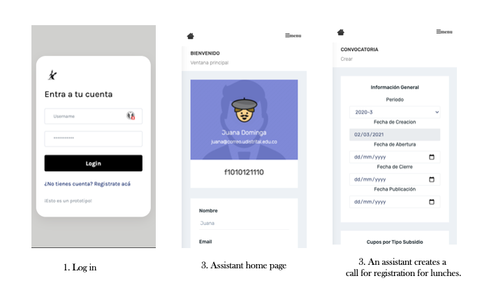
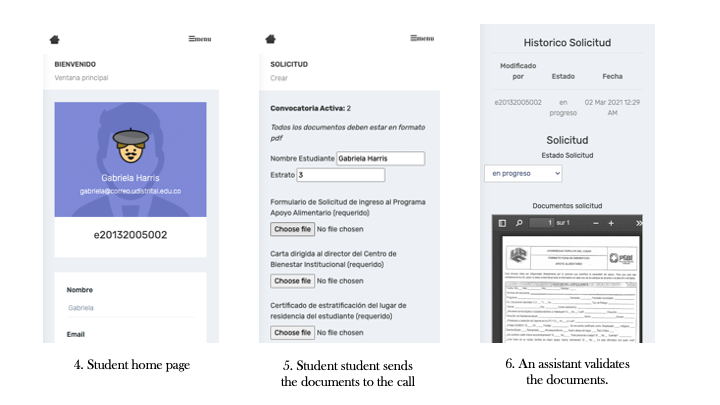
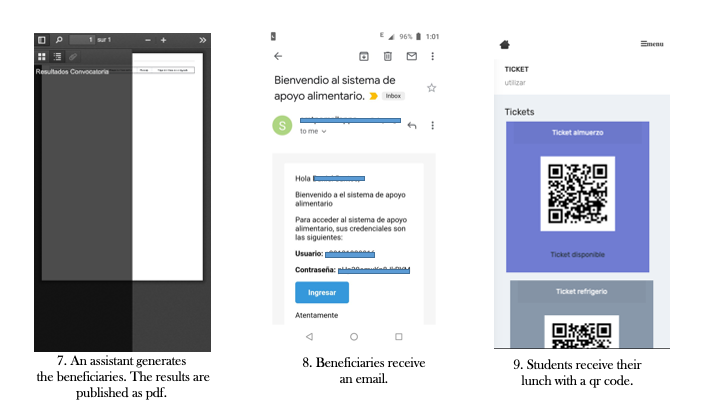
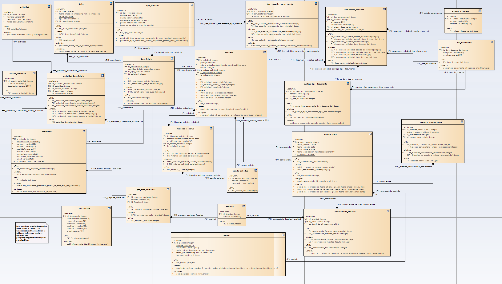

A simple prototype application to manage the logic behind restaurant tickets in a public university in Colombia, this use the security features of a database, then there are many features which are not included. This prototype will include:

- application process
- restaurant tickets
- review of applications

***It is worth to say it is just a prototype and it is develop for academic purposes for the subject databases, then the backend contains "many" problems.***


#### Demo 





### Instructions

#### Database
```sh
  $ cd schema
  # creates the db apoyo_alimentario and connect to the schema using psql
  $ sh utils/init.sh
  # execute the script to load the db, roles, grants, stored procedures, triggers
  apoyo_alimentario=# \i main.sql
  # exit of psql
  apoyo_alimentario=# \q
```

#### App
```sh
 $ python3 -m venv env-lunch/
 $ source env-lunch/bin/activate
 (env-lunch)$ pip3 install -r requirements.txt
 (env-lunch)$ cd app/
 (env-lunch)$ flask run # export FLASK_APP=app.py
```

#### Testing
```sh
 $ cd app/
 $ python3 -m pytest tests
```


#### Email
```sh
 $ export MAIL_USERNAME=XXXXX
 $ export MAIL_PASSWORD=XXXXX
```


#### Domain Model

<a href="schema/DomainModel.png"></a>
